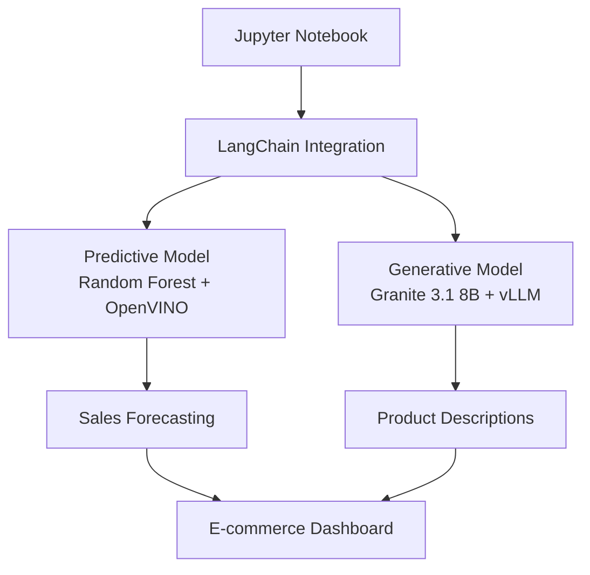

# Deploy, Serve & Scale: OpenShift AI End-to-End Workshop
## Intelligent E-commerce Recommendation and Analysis System

<div align="center">


</div>

---

## 🌐 Language / Idioma

**[🇺🇸 English Version](./docs/en/README.md)** - Complete workshop guide in English

**[🇪🇸 Versión en Español](./docs/es/README.md)** - Guía completa del taller en español

---

## 📋 Quick Overview

This workshop provides hands-on experience with deploying, serving, and scaling AI models on OpenShift AI platform. You'll build an intelligent e-commerce system that combines predictive and generative AI models.

**Instructor:** Carlos Estay  
**Email:** cestay@redhat.com  
**GitHub:** [pkstaz](https://github.com/pkstaz)

---

## 🎯 What You'll Learn

- Deploy predictive models using ONNX and OpenVINO
- Serve generative models with vLLM and Granite 3.1 8B
- Integrate models using LangChain framework
- Build interactive AI-powered dashboards
- Implement monitoring and optimization strategies

---

## 🏗️ System Architecture



---

## 📚 Module Structure

| Module | Topic | Duration | Description |
|--------|-------|----------|-------------|
| **1** | [Environment Setup](./docs/en/01-environment-setup.md) | 30 min | Configure OpenShift AI and prepare workspace |
| **2** | [Predictive Model](./docs/en/02-predictive-model.md) | 45 min | Deploy Random Forest with ONNX and OpenVINO |
| **3** | [Generative Model](./docs/en/03-generative-model.md) | 45 min | Serve Granite 3.1 8B using vLLM |
| **4** | [LangChain Integration](./docs/en/04-langchain-integration.md) | 45 min | Connect and orchestrate models |
| **5** | [Monitoring](./docs/en/05-monitoring.md) | 30 min | Implement monitoring and optimization |
| **6** | [Advanced MLOps](./docs/en/06-advanced-mlops.md) | 30 min | Production considerations and best practices |

---

## 🚀 Quick Start

### Prerequisites Checklist

- [ ] OpenShift cluster with OpenShift AI installed
- [ ] Access to Jupyter Hub
- [ ] Basic Python and ML knowledge
- [ ] Understanding of containerization concepts
- [ ] Familiarity with REST APIs

### Getting Started

1. **Choose your language:**
   - [🇺🇸 Continue in English](./docs/en/README.md)
   - [🇪🇸 Continuar en Español](./docs/es/README.md)

2. **Follow the step-by-step modules** in your preferred language

3. **Access the code files** referenced in each module (provided separately)

---

## 📂 Repository Structure

```
ai-ecommerce-workshop/
├── README.md                          # This file
├── docs/
│   ├── en/                           # English documentation
│   │   ├── README.md                 # English workshop guide
│   │   ├── 01-environment-setup.md
│   │   ├── 02-predictive-model.md
│   │   ├── 03-generative-model.md
│   │   ├── 04-langchain-integration.md
│   │   ├── 05-monitoring.md
│   │   └── 06-advanced-mlops.md
│   └── es/                           # Spanish documentation
│       ├── README.md                 # Spanish workshop guide
│       ├── 01-configuracion-entorno.md
│       ├── 02-modelo-predictivo.md
│       ├── 03-modelo-generativo.md
│       ├── 04-integracion-langchain.md
│       ├── 05-monitoreo.md
│       └── 06-mlops-avanzado.md
├── 1-environment/                    # Module 1: Environment setup
│   ├── download_datasets.ipynb
│   ├── install_requirements.ipynb
│   ├── verify_environment.ipynb
│   └── configs/
├── 2-predictive-model/               # Module 2: Sales forecasting model
│   ├── notebooks/
│   │   ├── 01_data_exploration.ipynb
│   │   ├── 02_feature_engineering.ipynb
│   │   ├── 03_train_model.ipynb
│   │   ├── 04_export_onnx.ipynb
│   │   └── 05_validate_onnx.ipynb
│   ├── deployment/
│   │   ├── serving-runtime.yaml
│   │   ├── inference-service.yaml
│   │   └── test_deployment.ipynb
│   └── models/                       # Exported models
├── 3-generative-model/               # Module 3: Granite 3.1 8B deployment
│   ├── notebooks/
│   │   ├── 01_resource_planning.ipynb
│   │   ├── 02_api_testing.ipynb
│   │   ├── 03_performance_benchmark.ipynb
│   │   └── 04_prompt_optimization.ipynb
│   └── deployment/
│       ├── serving-runtime.yaml
│       ├── inference-service.yaml
│       └── verify_deployment.ipynb
├── 4-langchain-integration/          # Module 4: LangChain orchestration
│   ├── notebooks/
│   │   ├── 01_setup_langchain.ipynb
│   │   ├── 02_model_wrappers.ipynb
│   │   ├── 03_product_analysis_chain.ipynb
│   │   ├── 04_customer_insight_chain.ipynb
│   │   ├── 05_market_analysis_chain.ipynb
│   │   ├── 06_dashboard.ipynb
│   │   └── 07_e2e_testing.ipynb
│   └── deployment/
│       └── deploy_dashboard.ipynb
├── 5-monitoring-optimization/        # Module 5: Monitoring and optimization
│   ├── monitoring/
│   │   ├── model_monitoring_config.yaml
│   │   ├── custom_metrics.ipynb
│   │   ├── prometheus_alerts.yaml
│   │   └── notification_config.yaml
│   └── optimization/
│       ├── model_quantization.ipynb
│       ├── caching_strategy.ipynb
│       └── autoscaling_config.yaml
├── 6-advanced-mlops/                 # Module 6: Advanced MLOps practices
│   ├── notebooks/
│   │   ├── model_versioning.ipynb
│   │   ├── quality_gates.ipynb
│   │   └── model_governance.ipynb
│   ├── pipelines/
│   │   ├── ab_testing.yaml
│   │   └── gitops_pipeline.yaml
│   └── security/
│       └── security_policies.yaml
├── troubleshooting/                  # Debugging and troubleshooting
│   ├── debug_onnx_conversion.ipynb
│   ├── test_endpoints.ipynb
│   └── common_issues.md
├── datasets/                         # Sample datasets (downloaded in module 1)
│   ├── sales_historical_data.csv
│   ├── product_catalog.csv
│   └── customer_behavior.csv
└── assets/                           # Images and diagrams
    ├── architecture_diagram.png
    └── workflow_diagrams/
```

---

## 🎯 Learning Outcomes

After completing this workshop, you will be able to:

- ✅ Deploy production-ready ML models on OpenShift AI
- ✅ Optimize inference performance using ONNX and OpenVINO
- ✅ Serve large language models with high throughput using vLLM
- ✅ Build end-to-end AI applications with LangChain
- ✅ Implement monitoring and scaling strategies
- ✅ Apply MLOps best practices for production deployments

---

## 🤝 Support and Feedback

**Instructor Contact:**
- **Name:** Carlos Estay
- **Email:** cestay@redhat.com
- **GitHub:** [pkstaz](https://github.com/pkstaz)

**For technical issues:**
- Create an issue in this repository
- Contact the instructor during workshop hours
- Check the troubleshooting sections in each module

---

## 📚 Additional Resources

- [OpenShift AI Documentation](https://docs.redhat.com/en/documentation/red_hat_openshift_ai_self-managed)
- [KServe Documentation](https://kserve.github.io/website/)
- [OpenVINO Documentation](https://docs.openvino.ai/)
- [vLLM Documentation](https://docs.vllm.ai/)
- [LangChain Documentation](https://python.langchain.com/)

---

**© 2025 Red Hat, Inc. - Workshop Material**