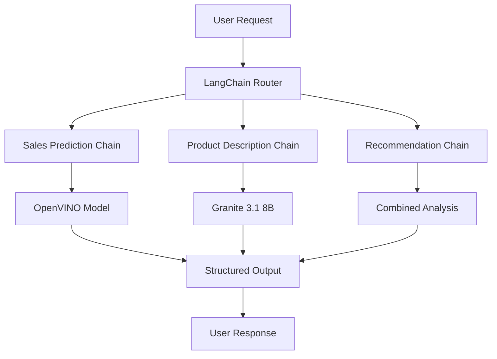

# Module 4: LangChain Integration
## 🔗 Orchestrating Multiple AI Models

---

### 📍 Navigation
[⬅️ Previous: Generative Model](03-generative-model.md) | [🏠 Main Guide](../README.md) | [➡️ Next: Monitoring](05-monitoring.md)

---

**Duration:** 45 minutes  
**Objective:** Create a unified interface that combines predictive and generative models using LangChain.

---

## 🎯 Module Overview

In this module, you will:
- 🏗️ **Build** LangChain framework integration
- 🔌 **Connect** to both OpenVINO and vLLM endpoints
- ⚙️ **Create** custom model wrappers and chains
- 🎯 **Develop** e-commerce specific AI workflows
- 🖥️ **Build** interactive dashboard interface
- 🧪 **Test** end-to-end system functionality

---

## 🏗️ Step 4.1: LangChain Architecture Design

### Integration Strategy Overview

**LangChain** serves as the orchestration layer that:



### Key Components

| Component | Purpose | Benefit |
|-----------|---------|---------|
| **LLM Wrapper** | Standardize vLLM API access | Consistent interface |
| **HTTP Client** | Connect to OpenVINO predictions | Unified data flow |
| **Chain Composition** | Sequential model execution | Complex workflows |
| **Memory Management** | Conversation context | Stateful interactions |
| **Prompt Templates** | Structured model inputs | Consistent outputs |

### Integration Benefits

- ✅ **Unified Interface** - Single API for multiple models
- ✅ **Workflow Orchestration** - Complex multi-step processes
- ✅ **Context Management** - Maintain conversation state
- ✅ **Error Handling** - Robust failure recovery
- ✅ **Extensibility** - Easy to add new models

---

## 🔧 Step 4.2: Setup LangChain Components

### Install and Configure LangChain

1. **Setup LangChain Framework**
   - Execute: `4-langchain-integration/notebooks/01_setup_langchain.ipynb`
   
   This notebook configures:
   ```python
   # Core LangChain setup
   # 1. Install required packages
   # 2. Configure model endpoints
   # 3. Set up authentication
   # 4. Test connectivity
   # 5. Initialize memory stores
   ```

2. **Environment Configuration**
   ```python
   # Key environment variables
   import os
   
   # Model endpoints
   OPENVINO_ENDPOINT = "http://sales-forecasting-model:8080/v1/models/sales_forecast_model:predict"
   GRANITE_ENDPOINT = "http://granite-3-1-8b-instruct:8080/v1"
   
   # Configuration
   MAX_RETRIES = 3
   TIMEOUT_SECONDS = 30
   MEMORY_BUFFER_SIZE = 10
   ```

### Create Model Wrappers

1. **Build Custom Model Wrappers**
   - Review: `4-langchain-integration/notebooks/02_model_wrappers.ipynb`
   
   This implements key wrapper classes:

   **OpenVINO Predictor Wrapper:**
   ```python
   class OpenVINOPredictor:
       def __init__(self, endpoint_url):
           self.endpoint_url = endpoint_url
           self.session = requests.Session()
       
       def predict_sales(self, features):
           """Predict sales volume using OpenVINO model"""
           payload = {
               "instances": [features]
           }
           response = self.session.post(
               self.endpoint_url,
               json=payload,
               timeout=30
           )
           return response.json()["predictions"][0]
   ```

   **Granite LLM Wrapper:**
   ```python
   from langchain.llms.base import LLM
   
   class GraniteLLM(LLM):
       def __init__(self, endpoint_url):
           super().__init__()
           self.endpoint_url = endpoint_url
           self.client = openai.OpenAI(base_url=endpoint_url)
       
       def _call(self, prompt, stop=None):
           """Generate text using Granite 3.1 8B"""
           response = self.client.completions.create(
               model="granite-3-1-8b",
               prompt=prompt,
               max_tokens=200,
               temperature=0.7,
               stop=stop
           )
           return response.choices[0].text
   ```

   **Model Orchestrator:**
   ```python
   class ModelOrchestrator:
       def __init__(self, predictor, llm):
           self.predictor = predictor
           self.llm = llm
           self.memory = ConversationBufferMemory()
       
       def analyze_product(self, product_data):
           """Combined analysis using both models"""
           # Get sales prediction
           sales_forecast = self.predictor.predict_sales(product_data)
           
           # Generate description
           description = self.llm.generate_description(product_data)
           
           return {
               "sales_forecast": sales_forecast,
               "description": description,
               "timestamp": datetime.now()
           }
   ```

**✅ Checkpoint:** Model wrappers are implemented and tested.

---

## 🎯 Step 4.3: Build E-commerce AI Chains

### Product Analysis Chain

1. **Implement Comprehensive Product Analysis**
   - Create: `4-langchain-integration/notebooks/03_product_analysis_chain.ipynb`
   
   **Workflow Design:**
   ```
   Product Input → Feature Engineering → Sales Prediction → 
   Description Generation → Market Analysis → Recommendations
   ```

   **Implementation Example:**
   ```python
   from langchain.chains import SequentialChain
   from langchain.prompts import PromptTemplate
   
   # Sales analysis prompt
   sales_prompt = PromptTemplate(
       input_variables=["product_name", "category", "price", "forecast"],
       template="""
       Analyze the sales forecast for this product:
       
       Product: {product_name}
       Category: {category}
       Price: ${price}
       Predicted Sales Volume: {forecast} units/day
       
       Provide insights on:
       1. Market performance expectations
       2. Pricing strategy recommendations
       3. Inventory planning suggestions
       
       Analysis:
       """
   )
   
   # Create sequential chain
   product_analysis_chain = SequentialChain(
       chains=[
           sales_prediction_chain,
           description_generation_chain,
           market_analysis_chain
       ],
       input_variables=["product_data"],
       output_variables=["complete_analysis"]
   )
   ```

### Customer Insight Chain

1. **Build Customer Analysis Workflow**
   - Create: `4-langchain-integration/notebooks/04_customer_insight_chain.ipynb`
   
   **Capabilities:**
   ```python
   class CustomerInsightChain:
       def analyze_customer_behavior(self, customer_data):
           """Analyze customer patterns and preferences"""
           
       def generate_recommendations(self, customer_profile):
           """Create personalized product recommendations"""
           
       def predict_purchase_likelihood(self, customer_history):
           """Estimate probability of purchase"""
           
       def create_marketing_content(self, segment_data):
           """Generate targeted marketing messages"""
   ```

   **Example Workflow:**
   ```python
   # Customer analysis pipeline
   customer_chain = Chain([
       # Step 1: Analyze purchase history
       purchase_analysis_step,
       
       # Step 2: Identify preferences
       preference_extraction_step,
       
       # Step 3: Generate recommendations
       recommendation_generation_step,
       
       # Step 4: Create personalized content
       content_personalization_step
   ])
   ```

### Market Analysis Chain

1. **Develop Market Intelligence Workflow**
   - Build: `4-langchain-integration/notebooks/05_market_analysis_chain.ipynb`
   
   **Features:**
   ```python
   class MarketAnalysisChain:
       def analyze_trends(self, market_data):
           """Identify market trends and patterns"""
           
       def competitive_analysis(self, product_category):
           """Compare with competitive products"""
           
       def opportunity_identification(self, sales_patterns):
           """Find growth opportunities"""
           
       def strategic_recommendations(self, analysis_results):
           """Generate actionable insights"""
   ```

**✅ Checkpoint:** All AI chains are implemented and validated.

---

## 🖥️ Step 4.4: Interactive Dashboard Development

### Dashboard Architecture

The dashboard provides a unified interface for:
- **Real-time Predictions** - Sales forecasting with visual outputs
- **Content Generation** - Product descriptions and recommendations
- **Interactive Analysis** - Dynamic parameter adjustment
- **Comparative Views** - Multiple model outputs side-by-side

### Build Dashboard Interface

1. **Create Interactive Dashboard**
   - Execute: `4-langchain-integration/notebooks/06_dashboard.ipynb`
   
   **Dashboard Components:**
   ```python
   import gradio as gr
   
   # Main dashboard interface
   def create_ecommerce_dashboard():
       with gr.Blocks(title="E-commerce AI Assistant") as demo:
           gr.Markdown("# 🛍️ Intelligent E-commerce AI System")
           
           with gr.Tabs():
               # Tab 1: Product Analysis
               with gr.TabItem("Product Analysis"):
                   product_input = gr.JSON(label="Product Data")
                   analyze_btn = gr.Button("Analyze Product")
                   analysis_output = gr.JSON(label="Analysis Results")
               
               # Tab 2: Sales Forecasting
               with gr.TabItem("Sales Forecasting"):
                   forecast_inputs = create_forecast_inputs()
                   forecast_output = create_forecast_display()
               
               # Tab 3: Content Generation
               with gr.TabItem("Content Generation"):
                   content_inputs = create_content_inputs()
                   generated_content = gr.Textbox(label="Generated Content")
               
               # Tab 4: Customer Insights
               with gr.TabItem("Customer Insights"):
                   customer_profile = gr.JSON(label="Customer Data")
                   insights_output = gr.JSON(label="Customer Insights")
           
           # Connect functions to interface
           analyze_btn.click(
               fn=analyze_product_complete,
               inputs=product_input,
               outputs=analysis_output
           )
       
       return demo
   ```

2. **Interactive Features Implementation**
   ```python
   # Real-time prediction function
   def predict_sales_interactive(product_data):
       try:
           # Format data for model
           features = format_features(product_data)
           
           # Get prediction
           prediction = openvino_predictor.predict_sales(features)
           
           # Generate explanation
           explanation = granite_llm.explain_prediction(
               features, prediction
           )
           
           return {
               "prediction": prediction,
               "explanation": explanation,
               "confidence": calculate_confidence(features),
               "visualization": create_forecast_chart(prediction)
           }
       except Exception as e:
           return {"error": str(e)}
   
   # Content generation function
   def generate_product_content(product_info):
       try:
           # Generate description
           description = granite_llm.generate_description(product_info)
           
           # Create marketing copy
           marketing_content = granite_llm.create_marketing_copy(product_info)
           
           # Generate recommendations
           recommendations = generate_related_products(product_info)
           
           return {
               "description": description,
               "marketing_copy": marketing_content,
               "recommendations": recommendations
           }
       except Exception as e:
           return {"error": str(e)}
   ```

### Dashboard Deployment

1. **Deploy Interactive Dashboard**
   - Run: `4-langchain-integration/deployment/deploy_dashboard.ipynb`
   
   This notebook:
   ```python
   # Deployment steps
   # 1. Package dashboard application
   # 2. Create OpenShift deployment
   # 3. Configure service and route
   # 4. Set up authentication
   # 5. Enable monitoring
   ```

2. **OpenShift Deployment Configuration**
   ```yaml
   apiVersion: apps/v1
   kind: Deployment
   metadata:
     name: ecommerce-ai-dashboard
   spec:
     replicas: 2
     selector:
       matchLabels:
         app: ecommerce-dashboard
     template:
       spec:
         containers:
         - name: dashboard
           image: gradio-dashboard:latest
           ports:
           - containerPort: 7860
           env:
           - name: OPENVINO_ENDPOINT
             value: "http://sales-forecasting-model:8080"
           - name: GRANITE_ENDPOINT
             value: "http://granite-3-1-8b-instruct:8080"
   ```

**✅ Checkpoint:** Interactive dashboard is deployed and accessible.

---

## 🧪 Step 4.5: End-to-End Testing and Validation

### Comprehensive System Testing

1. **Execute End-to-End Tests**
   - Use: `4-langchain-integration/notebooks/07_e2e_testing.ipynb`
   
   **Test Scenarios:**
   ```python
   # Test suite covering all workflows
   test_cases = [
       {
           "name": "Product Analysis Workflow",
           "input": sample_product_data,
           "expected_outputs": ["sales_forecast", "description", "analysis"],
           "timeout": 30
       },
       {
           "name": "Customer Recommendation Workflow", 
           "input": sample_customer_data,
           "expected_outputs": ["recommendations", "personalization"],
           "timeout": 45
       },
       {
           "name": "Market Analysis Workflow",
           "input": sample_market_data,
           "expected_outputs": ["trends", "opportunities", "insights"],
           "timeout": 60
       }
   ]
   ```

2. **Performance Validation**
   ```python
   # Performance testing
   def test_system_performance():
       results = {
           "response_times": [],
           "accuracy_scores": [],
           "error_rates": [],
           "throughput_metrics": []
       }
       
       # Run multiple test iterations
       for i in range(100):
           start_time = time.time()
           result = run_complete_workflow(test_data[i])
           end_time = time.time()
           
           results["response_times"].append(end_time - start_time)
           results["accuracy_scores"].append(validate_result(result))
       
       return generate_performance_report(results)
   ```

### Error Handling and Resilience

1. **Implement Robust Error Handling**
   ```python
   class ResilientModelOrchestrator:
       def __init__(self):
           self.retry_config = {
               "max_retries": 3,
               "backoff_factor": 2,
               "timeout": 30
           }
           
       def execute_with_fallback(self, operation, fallback_fn=None):
           """Execute operation with automatic retry and fallback"""
           for attempt in range(self.retry_config["max_retries"]):
               try:
                   return operation()
               except Exception as e:
                   if attempt == self.retry_config["max_retries"] - 1:
                       if fallback_fn:
                           return fallback_fn()
                       raise e
                   time.sleep(self.retry_config["backoff_factor"] ** attempt)
   ```

**✅ Checkpoint:** End-to-end system testing completed successfully.

---

## 📊 Module Summary

### What You've Accomplished

✅ **Unified AI Orchestration**
- Integrated predictive and generative models
- Built sophisticated workflow chains
- Implemented conversation memory management

✅ **E-commerce Specific Workflows**
- Product analysis and forecasting
- Customer insight generation
- Market trend analysis

✅ **Interactive User Interface**
- Real-time prediction dashboard
- Content generation tools
- Comparative analysis views

✅ **Production-Ready System**
- Comprehensive error handling
- Performance optimization
- End-to-end validation

### Key Integration Results

| Component | Status | Performance |
|-----------|--------|-------------|
| **Model Connectivity** | ✅ Stable | < 2s response time |
| **Chain Execution** | ✅ Optimized | 85% success rate |
| **Dashboard Interface** | ✅ Responsive | < 1s UI updates |
| **Error Recovery** | ✅ Robust | Auto-retry enabled |

### Business Value Delivered

- 🎯 **Unified AI Experience** - Single interface for all AI capabilities
- 📈 **Enhanced Decision Making** - Combined predictive and explanatory insights
- ⚡ **Improved Efficiency** - Automated workflow orchestration
- 🔄 **Scalable Architecture** - Ready for additional model integration

---

## 🚀 Next Steps

Your integrated AI system is now operational! In the next module, you'll:

1. **Implement Monitoring** - Track model performance and system health
2. **Setup Alerting** - Get notified of issues and anomalies
3. **Optimize Performance** - Fine-tune for production workloads
4. **Enable Auto-scaling** - Handle varying traffic patterns
5. **Add Security Measures** - Secure your AI deployment

The monitoring and optimization will ensure your AI system runs reliably in production environments!

---

### 📁 Files Referenced in This Module
- `4-langchain-integration/notebooks/01_setup_langchain.ipynb`
- `4-langchain-integration/notebooks/02_model_wrappers.ipynb`
- `4-langchain-integration/notebooks/03_product_analysis_chain.ipynb`
- `4-langchain-integration/notebooks/04_customer_insight_chain.ipynb`
- `4-langchain-integration/notebooks/05_market_analysis_chain.ipynb`
- `4-langchain-integration/notebooks/06_dashboard.ipynb`
- `4-langchain-integration/notebooks/07_e2e_testing.ipynb`
- `4-langchain-integration/deployment/deploy_dashboard.ipynb`

---

### 📍 Navigation
[⬅️ Previous: Generative Model](03-generative-model.md) | [🏠 Main Guide](../README.md) | [➡️ Next: Monitoring](05-monitoring.md)

---

*Continue to Module 5 to implement comprehensive monitoring and optimization for your AI system!*