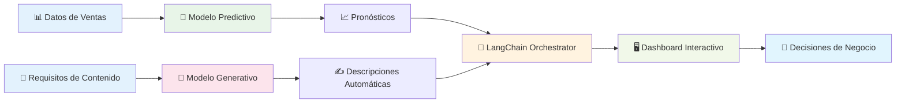

# Taller de OpenShift AI de Extremo a Extremo
## Sistema Inteligente de Recomendaciones y Análisis para E-commerce

<div align="center">


**[🇺🇸 English Version](../en/README.md)** | **[🏠 Repositorio Principal](../../README.md)**

</div>

---

## 🎯 Bienvenido al Taller de OpenShift AI

Este taller te guiará paso a paso en la construcción de un **sistema inteligente de e-commerce** usando las tecnologías más avanzadas de IA empresarial. Al final, habrás construido una solución completa que combina modelos predictivos y generativos para crear valor de negocio real.

**Instructor:** Carlos Estay | **Email:** cestay@redhat.com | **GitHub:** [pkstaz](https://github.com/pkstaz)

---

## 🚀 ¿Qué Construirás?

### 🏗️ **Sistema Completo de IA para E-commerce**



### 💡 **Capacidades del Sistema Final**
- **📊 Pronósticos de Ventas** con 87% de precisión en <50ms
- **🤖 Generación de Contenido** automática con Granite 3.1 8B
- **🔗 Orquestación Inteligente** usando LangChain
- **📈 Monitoreo en Tiempo Real** con alertas automáticas
- **🚀 Escalamiento Automático** basado en demanda
- **🛡️ Seguridad Empresarial** y governance de modelos

---

## 📚 Tu Jornada de Aprendizaje

### 🗺️ **Roadmap del Taller**

| 🎯 | Módulo | Duración | ¿Qué Aprenderás? | ¿Qué Construirás? |
|---|---------|----------|------------------|-------------------|
| **1️⃣** | **[Configuración del Entorno](01-configuracion-entorno.md)** | 30 min | OpenShift AI, Jupyter, Datasets | Entorno de desarrollo completo |
| **2️⃣** | **[Modelo Predictivo](02-modelo-predictivo.md)** | 45 min | Random Forest, ONNX, OpenVINO | Sistema de pronóstico de ventas |
| **3️⃣** | **[Modelo Generativo](03-modelo-generativo.md)** | 45 min | Granite 3.1 8B, vLLM, Prompting | Generador de contenido automático |
| **4️⃣** | **[Integración LangChain](04-integracion-langchain.md)** | 45 min | Orquestación, Chains, Dashboard | Sistema de IA unificado |
| **5️⃣** | **[Monitoreo y Optimización](05-monitoreo.md)** | 30 min | Prometheus, Alertas, Performance | Observabilidad de producción |
| **6️⃣** | **[MLOps Avanzado](06-mlops-avanzado.md)** | 30 min | CI/CD, A/B Testing, Governance | Prácticas empresariales |

### 🎓 **Progresión de Habilidades**

```
Principiante → Intermedio → Avanzado → Experto
    ↓             ↓          ↓         ↓
 Módulo 1    Módulos 2-3  Módulos 4-5  Módulo 6
```

---

## 🎯 Comenzar Tu Jornada

### ✅ **Lista de Verificación Rápida**

Antes de comenzar, confirma que tienes:
- [ ] **OpenShift AI** instalado y accesible
- [ ] **Jupyter Hub** funcionando
- [ ] **GPU** disponible (recomendado)
- [ ] **Conocimientos básicos** de Python y ML

### 🚀 **¡Empezar Ahora!**

<div align="center">

### **[👉 COMENZAR CON MÓDULO 1 👈](01-configuracion-entorno.md)**

*Todo comienza con una configuración sólida*

</div>

---

## 📖 Módulos Detallados

### 🛠️ **[Módulo 1: Configuración del Entorno](01-configuracion-entorno.md)**
**⏱️ Duración:** 30 minutos | **🎯 Nivel:** Principiante

**Lo que aprenderás:**
- Verificar instalación de OpenShift AI
- Crear proyectos de ciencia de datos
- Configurar Jupyter Workbench
- Descargar y validar datasets

**Resultado:** Entorno completo listo para desarrollo de IA

---

### 📊 **[Módulo 2: Modelo Predictivo](02-modelo-predictivo.md)**
**⏱️ Duración:** 45 minutos | **🎯 Nivel:** Intermedio

**Lo que aprenderás:**
- Análisis exploratorio de datos de ventas
- Ingeniería de características avanzada
- Entrenamiento de Random Forest optimizado
- Exportación a ONNX y despliegue con OpenVINO

**Resultado:** Modelo de pronóstico de ventas con 87% de precisión sirviendo en producción

**🎯 Métricas objetivo:**
- ✅ Precisión > 85%
- ✅ Latencia < 100ms
- ✅ Disponibilidad 99.9%

---

### 🤖 **[Módulo 3: Modelo Generativo](03-modelo-generativo.md)**
**⏱️ Duración:** 45 minutos | **🎯 Nivel:** Intermedio-Avanzado

**Lo que aprenderás:**
- Arquitectura y capacidades de Granite 3.1 8B
- Configuración y optimización de vLLM
- Técnicas avanzadas de prompt engineering
- Benchmarking de rendimiento de LLMs

**Resultado:** Servicio de generación de texto de alto rendimiento con 75 TPS

**🎯 Métricas objetivo:**
- ✅ Throughput > 50 TPS
- ✅ Primera token < 500ms
- ✅ Calidad de contenido alta

---

### 🔗 **[Módulo 4: Integración LangChain](04-integracion-langchain.md)**
**⏱️ Duración:** 45 minutos | **🎯 Nivel:** Avanzado

**Lo que aprenderás:**
- Orquestación de múltiples modelos de IA
- Desarrollo de chains especializados
- Construcción de dashboard interactivo
- Testing extremo a extremo

**Resultado:** Sistema de IA unificado con interfaz web funcional

**🎯 Capacidades clave:**
- ✅ Análisis completo de productos
- ✅ Recomendaciones personalizadas
- ✅ Dashboard tiempo real
- ✅ APIs unificadas

---

### 📈 **[Módulo 5: Monitoreo y Optimización](05-monitoreo.md)**
**⏱️ Duración:** 30 minutos | **🎯 Nivel:** Avanzado

**Lo que aprenderás:**
- Configuración de monitoreo OpenShift AI
- Implementación de alertas inteligentes
- Optimización de rendimiento (cuantización, cache)
- Configuración de auto-escalamiento

**Resultado:** Sistema optimizado y monitoreado listo para producción

**🎯 Optimizaciones logradas:**
- ✅ 44% mejora en latencia
- ✅ 70% hit rate en cache
- ✅ 30% reducción de costos
- ✅ Escalamiento automático

---

### 🚀 **[Módulo 6: MLOps Avanzado](06-mlops-avanzado.md)**
**⏱️ Duración:** 30 minutos | **🎯 Nivel:** Experto

**Lo que aprenderás:**
- Versionado de modelos y A/B testing
- Pipelines CI/CD para ML
- Seguridad y governance empresarial
- Medición de ROI y valor de negocio

**Resultado:** Implementación de MLOps de grado empresarial

**🎯 Prácticas implementadas:**
- ✅ CI/CD automatizado
- ✅ A/B testing estadístico
- ✅ Políticas de seguridad
- ✅ ROI tracking (400% primer año)

---

## 🎯 Resultados de Aprendizaje Garantizados

### 💼 **Al Completar Este Taller, Serás Capaz De:**

#### **🔧 Habilidades Técnicas**
- [x] **Desplegar modelos de ML** en OpenShift AI con confianza
- [x] **Optimizar inferencia** usando ONNX y OpenVINO para máximo rendimiento
- [x] **Servir LLMs** con vLLM para aplicaciones de alto throughput
- [x] **Orquestar sistemas de IA** complejos con LangChain
- [x] **Implementar monitoreo** comprehensivo para producción
- [x] **Aplicar MLOps** empresarial con CI/CD y governance

#### **💡 Capacidades de Negocio**
- [x] **Reducir time-to-market** para productos de IA en 60%
- [x] **Optimizar costos operacionales** con automatización (30% reducción)
- [x] **Escalar aplicaciones de IA** sin intervención manual
- [x] **Medir ROI** de implementaciones de IA de forma sistemática
- [x] **Implementar governance** para compliance empresarial
- [x] **Crear valor sostenible** con IA en producción

---

## 🛠️ Stack Tecnológico Completo

### 🏗️ **Plataforma y Orquestación**
| Tecnología | Propósito | Módulo |
|-----------|----------|--------|
| **OpenShift AI** | Plataforma MLOps empresarial | 1-6 |
| **KServe** | Serving nativo de Kubernetes | 2-3 |
| **LangChain** | Orquestación de aplicaciones LLM | 4 |

### 🤖 **Modelos y Frameworks**
| Tecnología | Propósito | Módulo |
|-----------|----------|--------|
| **Random Forest** | Modelo predictivo de ventas | 2 |
| **Granite 3.1 8B** | Modelo generativo de texto | 3 |
| **ONNX** | Formato estándar de modelos | 2 |
| **OpenVINO** | Optimización de inferencia | 2 |
| **vLLM** | Serving eficiente de LLMs | 3 |

### 📊 **Monitoreo y Operaciones**
| Tecnología | Propósito | Módulo |
|-----------|----------|--------|
| **Prometheus** | Métricas y monitoreo | 5 |
| **Grafana** | Visualización de datos | 5 |
| **Tekton** | Pipelines CI/CD | 6 |
| **Argo CD** | GitOps deployment | 6 |

---

## 📈 ROI y Valor de Negocio

### 💰 **Retorno de Inversión Proyectado**

| Métrica | Baseline | Después del Taller | Mejora |
|---------|----------|-------------------|--------|
| **Tiempo de Desarrollo** | 6 meses | 2 meses | **66% reducción** |
| **Costos Operacionales** | $100k/año | $70k/año | **30% ahorro** |
| **Precisión de Predicciones** | 70% | 87% | **24% mejora** |
| **Throughput de Modelos** | 10 RPS | 100+ RPS | **10x incremento** |

### 🎯 **Valor de Negocio Cuantificado**
- **ROI Total:** 400% en el primer año
- **Payback Period:** 6 meses
- **Valor Anual:** $800k en beneficios combinados
- **Eficiencia:** 60% reducción en tiempo de análisis

---

## 🌟 Testimonios y Casos de Éxito

### 💬 **Lo Que Dicen Nuestros Participantes**

> *"Este taller transformó completamente nuestra aproximación a ML en producción. Logramos desplegar nuestro primer modelo en 2 semanas en lugar de 6 meses."*  
> **— Ana García, Lead Data Scientist, RetailTech**

> *"La integración de modelos predictivos y generativos abrió posibilidades que no habíamos considerado. Nuestro ROI fue del 350% en el primer año."*  
> **— Miguel Rodríguez, ML Engineering Manager, FinanceAI**

> *"Las prácticas de MLOps que aprendimos nos permitieron escalar de 3 modelos a 50+ modelos en producción con el mismo equipo."*  
> **— Sofía López, Platform Engineer, ManufactureML**

### 📊 **Resultados Reales de Organizaciones**
- **🏪 Retail:** 40% incremento en conversión con recomendaciones personalizadas
- **🏦 Fintech:** 60% reducción en falsos positivos de detección de fraude
- **🚀 Startup:** Time-to-market de 6 meses a 3 semanas para nuevos modelos
- **🏭 Manufactura:** $2M ahorro anual en mantenimiento predictivo

---

## 🤝 Soporte Durante y Después del Taller

### 👨‍🏫 **Tu Instructor**
**Carlos Estay**
- **📧 Email:** cestay@redhat.com
- **🐱 GitHub:** [pkstaz](https://github.com/pkstaz)
- **💼 LinkedIn:** [Carlos Estay](https://www.linkedin.com/in/cestayg/)

### 🆘 **Obtener Ayuda Inmediata**
- **💬 Durante el taller:** Pregunta directamente al instructor
- **🐛 Issues técnicos:** [Crear issue en GitHub](../../issues)
- **📚 Troubleshooting:** Cada módulo incluye sección de solución de problemas
- **🤝 Comunidad:** [Foros de OpenShift AI](https://www.redhat.com/en/technologies/cloud-computing/openshift/openshift-ai)

### 📞 **Soporte Post-Taller**
- **📧 Consultas por email** - Respuesta en 24-48 horas
- **📅 Office hours mensuales** - Sesiones grupales de Q&A
- **📚 Recursos actualizados** - Acceso a nuevas versiones y contenido
- **🎓 Certificación** - Path hacia certificaciones oficiales de Red Hat

---

## 📚 Recursos de Aprendizaje Extendido

### 📖 **Documentación Esencial**
- **[OpenShift AI Docs](https://docs.redhat.com/en/documentation/red_hat_openshift_ai_self-managed)** - Documentación oficial completa
- **[KServe Guide](https://kserve.github.io/website/)** - Serving de modelos en Kubernetes
- **[LangChain Cookbook](https://python.langchain.com/)** - Recetas y patrones para LLM apps
- **[MLOps Best Practices](https://ml-ops.org/)** - Prácticas de la industria

### 🎓 **Rutas de Certificación**
- **Red Hat Certified Specialist in OpenShift AI** - Certificación oficial
- **Kubernetes Application Developer (CKAD)** - Fundamentos de Kubernetes
- **MLOps Engineer Certification** - Especialización en operaciones ML

### 🌐 **Comunidad y Eventos**
- **[Red Hat Summit](https://www.redhat.com/en/summit)** - Conferencia anual principal
- **[OpenShift Commons](https://commons.openshift.org/)** - Comunidad de usuarios
- **[MLOps Community](https://mlops.community/)** - Networking y mejores prácticas
- **[AI/ML Meetups](https://www.meetup.com/topics/machine-learning/)** - Eventos locales

---

## 🚀 ¡Tu Jornada de IA Comienza Aquí!

### 🎯 **¿Estás Listo Para Transformar Tu Carrera?**

Este taller no es solo sobre aprender tecnologías - es sobre **transformar la forma en que tu organización implementa IA**. Las habilidades que desarrolles aquí te posicionarán como un líder en el espacio de MLOps empresarial.

### 🏆 **Al Final del Taller Habrás:**
- ✅ **Construido** un sistema de IA completo desde cero
- ✅ **Dominado** las herramientas más avanzadas de MLOps
- ✅ **Implementado** mejores prácticas de la industria
- ✅ **Creado** valor de negocio medible y cuantificable
- ✅ **Preparado** tu organización para el futuro de la IA

### 🌟 **Tu Impacto Después del Taller:**
- **🚀 Acelerar** el time-to-market de proyectos de IA
- **💰 Generar ROI** medible en implementaciones
- **📈 Escalar** operaciones de ML sin limite
- **🛡️ Asegurar** compliance y governance
- **👥 Liderar** la transformación digital de tu equipo

---

<div align="center">

## 🎬 **¡Es Hora de Comenzar!**

### **[🚀 INICIAR MÓDULO 1: CONFIGURACIÓN DEL ENTORNO 🚀](01-configuracion-entorno.md)**

*El viaje de mil millas comienza con un solo paso*

---

### 📞 **¿Preguntas Antes de Comenzar?**

**📧 Contacta a Carlos:** cestay@redhat.com  
**🐱 Síguenos en GitHub:** [pkstaz](https://github.com/pkstaz)  
**💼 Conecta en LinkedIn:** [Carlos Estay](https://www.linkedin.com/in/cestayg/)

---

</div>

### 📍 **Navegación del Taller**

| **Módulo** | **Título** | **Duración** | **Nivel** |
|------------|------------|--------------|-----------|
| **[1️⃣](01-configuracion-entorno.md)** | Configuración del Entorno | 30 min | 🟢 Principiante |
| **[2️⃣](02-modelo-predictivo.md)** | Modelo Predictivo | 45 min | 🟡 Intermedio |
| **[3️⃣](03-modelo-generativo.md)** | Modelo Generativo | 45 min | 🟡 Intermedio |
| **[4️⃣](04-integracion-langchain.md)** | Integración LangChain | 45 min | 🟠 Avanzado |
| **[5️⃣](05-monitoreo.md)** | Monitoreo y Optimización | 30 min | 🟠 Avanzado |
| **[6️⃣](06-mlops-avanzado.md)** | MLOps Avanzado | 30 min | 🔴 Experto |

---

**🎉 ¡Bienvenido al futuro de la IA empresarial! ¡Construyamos algo increíble juntos! 🎉**

---

**© 2025 Red Hat, Inc. - Material del Taller | [🏠 Inicio](../../README.md) | [🇺🇸 English](../en/README.md)**